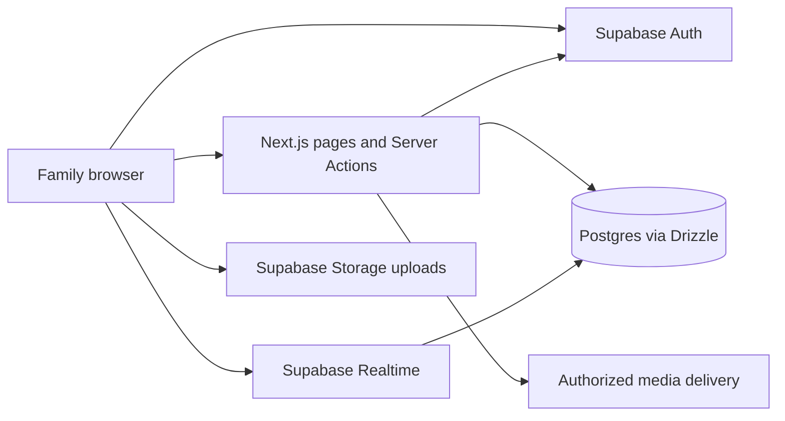

# System architecture

Next.js owns rendering and application authorization. Server Components load data; client components own interactive forms, dialogs, uploads, and live message state. `src/app/actions` is the primary mutation API. Supabase Auth manages credentials and sessions; the House's `members` table decides membership and role. [Auth and security](auth-and-security.md) explains why these are separate checks.

The server database connection is independent of the browser Supabase client. `db/index.ts` uses Postgres.js with a small pool, `prepare: false` for transaction pooling, and development connection reuse. Application authorization remains necessary even when RLS is enabled because the configured owner connection can bypass policies.

## Mutation contract

`ActionResult` in `src/types/index.ts` carries success and optional data or an error message. A usual action authenticates, validates, resolves the target, enforces role/ownership and state, commits, then invalidates affected routes. Callers must surface failures and refresh or reconcile local state after success. Auth helpers throw; forms also need unexpected-error handling.

Use transactions for coupled database state such as invitation redemption, final-Elder changes, and House identity updates. Network operations do not become atomic merely because a database transaction completed. Onboarding retries resolve existing active members without consuming another invite; membership no longer depends on a separate user-metadata update.

## Data lifecycle

Content uses soft deletion; membership uses activation; chambers and old gatherings are archived. RSVP is an atomic per-member upsert. Reactions are an interaction join that may be deleted when toggled off. The [schema reference](../40-reference/database-schema.md) lists constraints and retained historical tables.

Cached auth/settings are scoped with React `cache`, not a cross-user authorization cache. Route invalidation and browser refresh are separate concerns: revalidating server data does not automatically reconcile a client's `useState` array. Council combines server refreshes and realtime events.

## Operational boundary

A build can verify compilation without proving a remote Supabase project is configured. Database schema, SQL grants/RLS, Realtime publication, Storage settings, Auth redirects/email templates, and deployment variables each need explicit verification. See [setup](../50-operations/local-setup.md) and [release](../50-operations/release-runbook.md).
