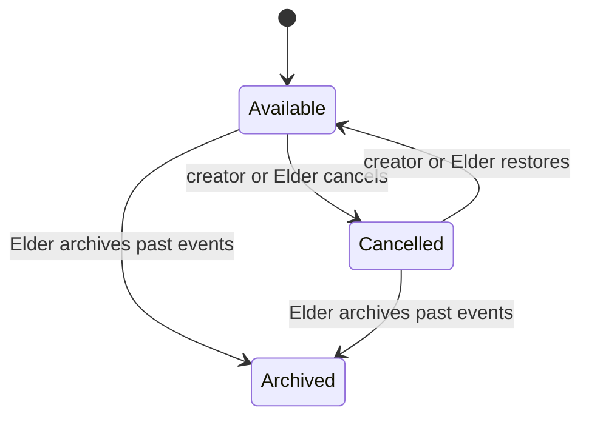

# Gatherings

Members and Elders can plan a gathering with title, description, location, start, optional end, and all-day flag. All active roles, including guests, can RSVP. This exception includes a guest in family plans without granting general publishing rights.

## Lifecycle

Cancellation preserves the event and remains visible with its status; restoration reverses a mistake. Archival removes old events from ordinary lists and blocks edits/RSVPs. The Current/Archived navigation exposes retained events through `/gatherings?view=archived`; archived events remain read-only. There is no gathering unarchive action.

The creator or an Elder can edit an available event. Runtime ID/status checks protect action boundaries. The input validator and database enforce end-after-start. `updateRsvp` atomically upserts one row per gathering/member; unavailable/cancelled/archived targets are rejected. RSVP note input is bounded.

`archivePastGatherings` validates a threshold of whole days and uses the event end, falling back to start, so ongoing events are not swept merely because they began in the past. The default sweep threshold is seven days. Archive/cancel/restore operations create audit entries and refresh summary/detail surfaces.

## Time and UI

Timed gathering inputs are converted to instants and displayed in the viewer's device timezone. All-day gatherings encode a calendar date in the UTC part of a timestamp: `calendarDayStart` and `calendarDayEnd` preserve the chosen first/last days, while `calendarDate` reconstructs the local display from UTC date components. Editing uses the same date-only input convention. This keeps the displayed all-day date consistent across timezones without changing the underlying timestamp columns. It is not a recurring schedule. The current/past split uses the end timestamp where present, so ongoing events stay in the current list until they end.

After an RSVP, the selected state, total, and attendee list must update without a full navigation. After editing, the detail and Great Hall summaries must agree. Cancelled events must explain why RSVP is disabled, and restoration must be discoverable to the owner/Elder.

## Verify

Create/edit an event; reject end-before-start; switch every RSVP status rapidly; verify guest RSVP; cancel, restore, and archive; test unrelated-member denial and invalid UUIDs; inspect narrow layouts and all-day date rendering. [Server Actions](../40-reference/server-actions.md) lists the entry points.
