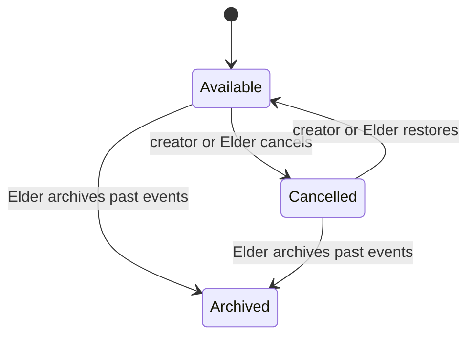

# Gatherings

Members and Elders can plan a gathering with title, description, location, start, optional end, and all-day flag. All active roles, including guests, can RSVP. This exception includes a guest in family plans without granting general publishing rights.

## Lifecycle

Cancellation preserves the event and remains visible with its status; restoration reverses a mistake. Archival removes old events from ordinary lists and blocks edits/RSVPs. The Current/Archived navigation exposes retained events through `/gatherings?view=archived`; archived events remain read-only. There is no gathering unarchive action.

The creator or an Elder can edit an available event. Runtime ID/status checks protect action boundaries, and the state check is repeated inside the write: `updateGathering` updates only a row that is still not cancelled and not archived, and `setGatheringCancelled` (behind `cancelGathering`/`uncancelGathering`) only a row that is not archived and still in the expected prior state, each with `RETURNING`. If an archive or cancellation committed after the action read the row, nothing is written and the caller gets a recoverable message such as "This gathering was archived while you were working on it. Your changes weren't saved." A concurrent identical cancel or restore counts as success without a second audit entry. The input validator and database enforce end-after-start. `updateRsvp` atomically upserts one row per gathering/member; unavailable/cancelled/archived targets are rejected. RSVP note input is bounded.

`archivePastGatherings` validates a threshold of whole days and uses the event end, falling back to start, so ongoing events are not swept merely because they began in the past. The default sweep threshold is seven days, and `ArchivePastButton` tells the Elder that events which *ended* more than seven days ago move out of the list. The sweep is one UPDATE statement, so if a reschedule commits while it waits for a row, PostgreSQL rechecks the end time against the rescheduled version. Its cutoff is bound as an ISO string cast to `timestamptz`; an earlier version bound a raw `Date` inside `sql`, which the driver rejected, so the button failed against real PostgreSQL. Archive/cancel/restore operations create audit entries and refresh summary/detail surfaces.

## Time and UI

Timed gathering inputs are converted to instants and displayed in the viewer's device timezone. All-day gatherings encode a calendar date in the UTC part of a timestamp: `calendarDayStart` and `calendarDayEnd` preserve the chosen first/last days, while `calendarDate` reconstructs the local display from UTC date components. Editing uses the same date-only input convention. `GatheringDate` renders the gathering surfaces from this contract: `long` on the detail page, `short` plus month/day `part`s on list and Great Hall tiles, and `date` (`formatGatheringDay`, weekday and day only) for a member profile's "Coming up" list. It waits for hydration, so a timed event shows the viewer's local day, not the server's. The Great Hall's one-line `HallSummary` names the next gathering through `GatheringDayPhrase` ("is today", "is tomorrow", "is on Saturday"), which also waits for hydration and counts days on the viewer's calendar. Its birthday wording ("today"/"tomorrow") is still computed with the server's date — a reviewed candidate, not yet a proven defect. This keeps the displayed all-day date consistent across timezones without changing the underlying timestamp columns. It is not a recurring schedule. The current/past split uses the end timestamp where present, so ongoing events stay in the current list until they end.

`GatheringForm` captures its `FormData`, then disables every field and both Save and Cancel through `HydratedFieldset` and sets `aria-busy` until the request settles, so nothing typed during a save can be silently dropped by the navigation that follows. A failed save re-enables the fields with the draft intact and returns focus to Save for a retry.

After an RSVP, the selected state, total, and attendee list must update without a full navigation. After editing, the detail and Great Hall summaries must agree. Cancelled events must explain why RSVP is disabled, and restoration must be discoverable to the owner/Elder.

## Verify

Create/edit an event; reject end-before-start; switch every RSVP status rapidly; verify guest RSVP; cancel, restore, and archive; test unrelated-member denial and invalid UUIDs; inspect narrow layouts and all-day date rendering. `gatherings.database.test.ts` commits a competing archive, cancel or reschedule between an action's read and write on real PostgreSQL; `follow-up.spec.ts` covers the cross-surface viewer-local day, the pending/failed save, and the Elder's Archive past button. [Server Actions](../40-reference/server-actions.md) lists the entry points.
