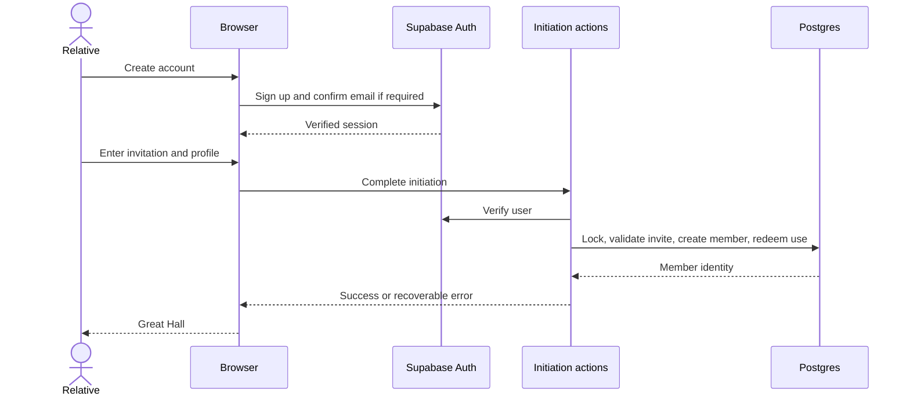

# Join and recover access

## Fresh House

Prepare schema and policies before signup. Set a strong bootstrap code only for the first member; that member becomes Elder under a serialized transaction. Remove the environment code afterward. Future relatives receive codes created through Elder Council.

## Ordinary invitation

The relative creates/signs into an Auth account, follows confirmation if required, enters the shared code, and completes a profile. A validation screen never consumes the invite. Completion performs the security check and redemption. A code may become unavailable between those steps; preserve input and explain the fresh-code recovery.

The retry path must recognize an already-created member after an interrupted response without spending another use. Inactive users see paused-access guidance and need an Elder to reactivate them. They cannot bypass that by repeating initiation.

## Account recovery

Sign-in translates provider errors into useful language. Unconfirmed users can request another confirmation; forgotten-password submits a recovery email pointing through `/auth/confirm` to `/reset-password`. The callback accepts supported session/token exchange styles and checks the destination. Failed/expired links return to sign-in with recovery guidance.

Sign-in, signup, and forgotten-password use `HydratedFieldset` so their controlled inputs become editable only after client handlers attach. The reset form already waits for its client session check before showing editable password controls. This keeps early input from being accepted into an unbound form.

Auth URL and email-template configuration are separate operational preconditions. A successful local form submit does not prove email delivery or that a link opens the correct deployed origin. See [local setup](../50-operations/local-setup.md).

## Acceptance scenarios

Verify with valid, invalid, expired, revoked, and exhausted invitations; duplicate completion; competing final-use redemptions; a missing bootstrap configuration; unconfirmed and inactive users; expired confirmation/recovery links; an off-site `next` parameter; interrupted network; and mobile input/keyboard behavior. Record which scenarios ran against actual Supabase versus mocks.
